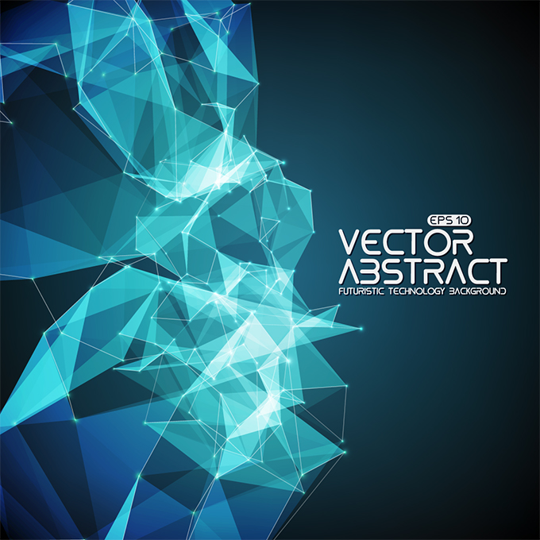

nanocode38

<!--   skyline  3D  -->

<!--   my-icons -->

    
    
    
    
    
       

<!--   my-header-img -->

                                       

<!--   skyline  3D  -->

**📫 How to Reach me:**

<!--  -->
<!--  -->

